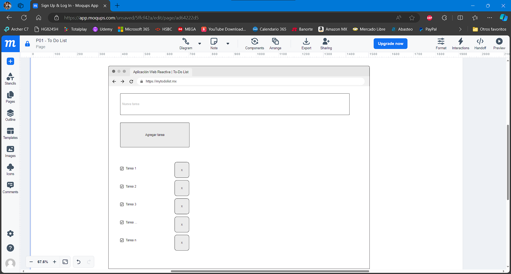
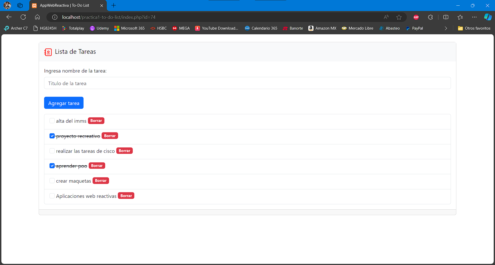
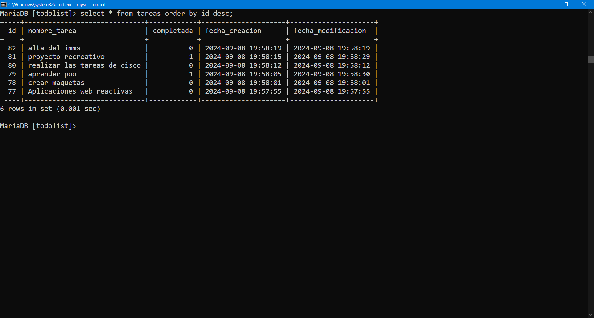

# TareasApp
## Descrición
Aplicación web full stack de gestión de tareas que permita a los usuarios  agregar, editar, marcar como completadas y eliminar tareas. Los datos de las tareas se almacenarán en una base de datos MySQL utilizando PHP para la interacción del lado  del servidor.

## Entorno de Desarrollo
Se uso el IDE Visual Studio Code en conjunto con XAMPP, un software gratuito y fácil de instalar que contiene MariaDB, PHP y Perl. El paquete de instalación de XAMPP ha sido diseñado para ser increíblemente fácil de instalar y usar.

## UI/XU
Para la maquetación del la interfaz de usuario, se uso el software online [moqups](https://moqups.com/).

Maquetado de la Aplicación


Diseño final de la Aplicación



## FrontEnd
Para el frontend usan las tecnologias web comunes (HTML, CSS) y Bootstrap v5, haciendo la contruccion de la aplicacion mas rapido.

## BackEnd
En el proyecto del lado del servidor, se uso PHP en conjunto con MySQL como motor de base de datos.

Base de datos


# Instalación
Primero que nada, tener el software [XAMPP](https://www.apachefriends.org/es/index.html)
```bash
git clone https://github.com/JoseTorresMX/practica1-to-do-list.git
```
